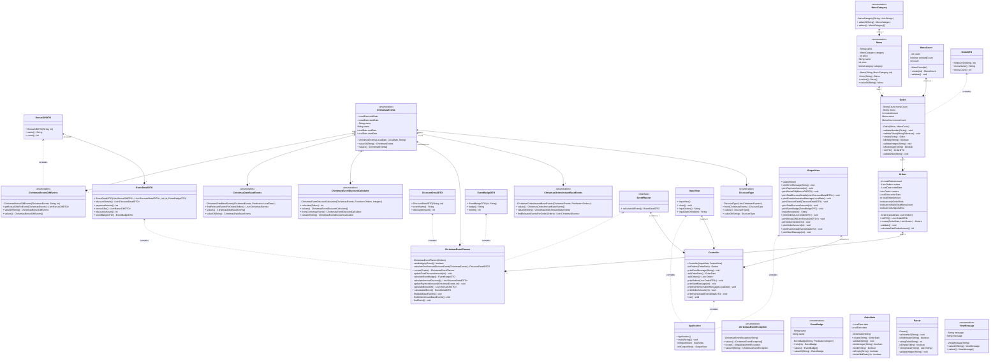

```mermaid
classDiagram
direction BT
class Application {
  + Application() 
  + main(String[]) void
  - initInputView() InputView
  - initOutputView() OutputView
}
class BonusGiftDTO {
  + BonusGiftDTO(String, int) 
  + name() String
  + count() int
}
class ChristmasBonusGiftEvents {
<<enumeration>>
  - ChristmasBonusGiftEvents(ChristmasEvents, String, int) 
  + getBonusGiftsForEvent(ChristmasEvents) List~BonusGiftDTO~
  + valueOf(String) ChristmasBonusGiftEvents
  + values() ChristmasBonusGiftEvents[]
}
class ChristmasDateBaseEvents {
<<enumeration>>
  - ChristmasDateBaseEvents(ChristmasEvents, Predicate~LocalDate~) 
  + findRelevantEventsForOrder(Orders) List~ChristmasEvents~
  + values() ChristmasDateBaseEvents[]
  + valueOf(String) ChristmasDateBaseEvents
}
class ChristmasEventDiscountCalculator {
<<enumeration>>
  - ChristmasEventDiscountCalculator(ChristmasEvents, Function~Orders, Integer~) 
  + calculate(Orders) int
  + values() ChristmasEventDiscountCalculator[]
  + from(ChristmasEvents) ChristmasEventDiscountCalculator
  + valueOf(String) ChristmasEventDiscountCalculator
}
class ChristmasEventException {
<<enumeration>>
  - ChristmasEventException(String) 
  + values() ChristmasEventException[]
  + create() IllegalArgumentException
  + valueOf(String) ChristmasEventException
}
class ChristmasEventPlanner {
  - ChristmasEventPlanner(Orders) 
  - canNotApplyEvent() boolean
  - calculateOneAmountDiscountEvent(ChristmasEvents) DiscountDetailDTO?
  + create(Orders) ChristmasEventPlanner
  - updateTotalDiscountAmount(int) void
  - calculateEventBadge() EventBadgeDTO
  - calculateAmountDiscount() List~DiscountDetailDTO~
  - updatePaymentAmount(ChristmasEvents, int) void
  - calculateBonusGift() List~BonusGiftDTO~
  + calculateAllEvent() EventDetailDTO
  - findDateBaseEvents() void
  - findOrderAmountBaseEvents() void
  - findEvent() void
}
class ChristmasEvents {
<<enumeration>>
  - ChristmasEvents(LocalDate, LocalDate, String) 
  - LocalDate endDate
  - LocalDate startDate
  - String name
  + valueOf(String) ChristmasEvents
  + values() ChristmasEvents[]
   String name
   LocalDate endDate
   LocalDate startDate
}
class ChristmasOrderAmountBaseEvents {
<<enumeration>>
  - ChristmasOrderAmountBaseEvents(ChristmasEvents, Predicate~Orders~) 
  + values() ChristmasOrderAmountBaseEvents[]
  + valueOf(String) ChristmasOrderAmountBaseEvents
  + findRelevantEventsForOrder(Orders) List~ChristmasEvents~
}
class Controller {
  + Controller(InputView, OutputView) 
  - initOrders(OrderDate) Orders
  - printErrorMessage(String) void
  - askOrderDate() OrderDate
  - askOrders() List~Order~
  - printOrders(List~OrderDTO~) void
  - printStartMessage(int) void
  - printEventInformationMessage(LocalDate) void
  - printOrderAmount(int) void
  - printEventDetail(EventDetailDTO) void
  + run() void
}
class DiscountDetailDTO {
  + DiscountDetailDTO(String, int) 
  + eventName() String
  + discountAmount() int
}
class DiscountType {
<<enumeration>>
  - DiscountType(List~ChristmasEvents~) 
  + from(ChristmasEvents) DiscountType
  + values() DiscountType[]
  + valueOf(String) DiscountType
}
class EventBadge {
<<enumeration>>
  - EventBadge(String, Predicate~Integer~) 
  - String name
  + from(int) EventBadge
  + values() EventBadge[]
  + valueOf(String) EventBadge
   String name
}
class EventBadgeDTO {
  + EventBadgeDTO(int, String) 
  + badge() String
  + month() int
}
class EventDetailDTO {
  + EventDetailDTO(List~BonusGiftDTO~, List~DiscountDetailDTO~, int, int, EventBadgeDTO) 
  + discountDetails() List~DiscountDetailDTO~
  + paymentAmount() int
  + bonusGifts() List~BonusGiftDTO~
  + discountAmount() int
  + eventBadgeDTO() EventBadgeDTO
}
class EventPlanner {
<<Interface>>
  + calculateAllEvent() EventDetailDTO
}
class InputView {
  + InputView() 
  + close() void
  + inputOrders() String
  + inputDateOfVisit(int) String
}
class Menu {
<<enumeration>>
  - Menu(String, MenuCategory, int) 
  - String name
  - MenuCategory category
  - int price
  + from(String) Menu
  + values() Menu[]
  + valueOf(String) Menu
   String name
   int price
   MenuCategory category
}
class MenuCategory {
<<enumeration>>
  - MenuCategory(String, List~String~) 
  + valueOf(String) MenuCategory
  + values() MenuCategory[]
}
class MenuCount {
  - MenuCount(int) 
  - int count
  + create(int) MenuCount
  - validate() void
   boolean notValidCount
   int count
}
class Order {
  - Order(Menu, MenuCount) 
  - MenuCount menuCount
  - Menu menu
  - validateNumber(String) void
  - validateToken(StringTokenizer) void
  + create(String) Order
  - isEmpty(String) boolean
  - validateInteger(String) void
  - isNotInteger(String) boolean
  + toDTO() OrderDTO
  - validateNull(String) void
   int orderAmount
   Menu menu
   MenuCount menuCount
}
class OrderDTO {
  + OrderDTO(String, int) 
  + menuName() String
  + menuCount() int
}
class OrderDate {
  - OrderDate(String) 
  - LocalDate date
  + create(String) OrderDate
  - validate(String) void
  - isNotInteger(String) boolean
  - isNull(String) boolean
  - isEmpty(String) boolean
  - isNotValidDate(int) boolean
   LocalDate date
}
class Orders {
  - Orders(LocalDate, List~Order~) 
  - int totalOrderAmount
  - List~Order~ orders
  - LocalDate orderDate
  + toDTO() List~OrderDTO~
  + create(OrderDate, List~Order~) Orders
  - validate() void
  - calculateTotalOrderAmount() int
   List~Order~ orders
   LocalDate orderDate
   int totalOrderAmount
   boolean onlyOrderDrink
   boolean notValidTotalMenuCount
   boolean notUniqueMenu
}
class OutputView {
  + OutputView() 
  + printErrorMessage(String) void
  - printPaymentAmount(int) void
  - printBonusGift(BonusGiftDTO) void
  - printTotalDiscountDetails(List~DiscountDetailDTO~) void
  + printEventInformationMessage(LocalDate) void
  - printDiscountDetail(DiscountDetailDTO) void
  - printTotalDiscountAmount(int) void
  - printEventBadge(EventBadgeDTO) void
  - makeAmount(int) String
  + printOrders(List~OrderDTO~) void
  - printBonusGift(List~BonusGiftDTO~) void
  - printOrder(OrderDTO) void
  + printOrderAmount(int) void
  + printEventDetail(EventDetailDTO) void
  + printStartMessage(int) void
}
class Parser {
  - Parser() 
  - validateNull(String) void
  - isNotInteger(String) boolean
  + stringToInt(String) int
  - isEmpty(String) boolean
  + stringToList(String) List~String~
  - validateInteger(String) void
}
class ViewMessage {
<<enumeration>>
  - ViewMessage(String) 
  - String message
  + valueOf(String) ViewMessage
  + values() ViewMessage[]
   String message
}

Application  ..>  Controller : «create»
Application  ..>  InputView : «create»
Application  ..>  OutputView : «create»
ChristmasBonusGiftEvents  ..>  BonusGiftDTO : «create»
ChristmasBonusGiftEvents "1" *--> "event 1" ChristmasEvents 
ChristmasDateBaseEvents "1" *--> "event 1" ChristmasEvents 
ChristmasEventDiscountCalculator "1" *--> "event 1" ChristmasEvents 
ChristmasEventPlanner "1" *--> "christmasEvents *" ChristmasEvents 
ChristmasEventPlanner  ..>  DiscountDetailDTO : «create»
ChristmasEventPlanner  ..>  EventBadgeDTO : «create»
ChristmasEventPlanner  ..>  EventDetailDTO : «create»
ChristmasEventPlanner  ..>  EventPlanner 
ChristmasEventPlanner "1" *--> "orders 1" Orders 
ChristmasOrderAmountBaseEvents "1" *--> "event 1" ChristmasEvents 
Controller "1" *--> "eventPlanner 1" EventPlanner 
Controller "1" *--> "inputView 1" InputView 
Controller "1" *--> "outputView 1" OutputView 
DiscountType "1" *--> "events *" ChristmasEvents 
EventDetailDTO "1" *--> "bonusGifts *" BonusGiftDTO 
Menu "1" *--> "category 1" MenuCategory 
Order "1" *--> "menu 1" Menu 
Order "1" *--> "menuCount 1" MenuCount 
Order  ..>  OrderDTO : «create»
Orders "1" *--> "orders *" Order 
```
